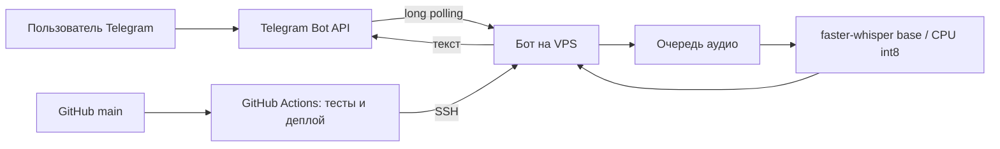

# Telegram Voice Transcriber


Telegram-бот для расшифровки голосовых и аудиосообщений на собственном VPS.
Попробовать: [@thisIsTranscriptBot](https://t.me/thisIsTranscriptBot) (доступ
ограничен списком пользователей). Распознавание выполняет `faster-whisper` на
CPU; платный API и LLM не используются.

**Рабочее развёртывание:** Ubuntu VPS → `systemd` → опрос Telegram Bot API.
GitHub Actions запускает тесты и доставляет изменения на VPS после успешного
push в `main`. Компьютер разработчика для работы бота не нужен. Подробности и
проверенные ограничения приведены в [отчёте об архитектуре](docs/architecture.md).



## Возможности

- Расшифровывает голосовые сообщения, аудиофайлы и аудио, отправленные как
  документ: WAV, MP3, M4A, OGG/OPUS, FLAC, AAC, WMA, WEBM, MP4.
- Распознаёт на VPS через `faster-whisper`; аудио скачивается из Telegram на
  VPS и не передаётся в сторонний API или LLM.
- Ограничение доступа по списку Telegram user_id (`ALLOWED_USER_IDS`) или
  открытый режим для всех, кто напишет боту.
- Очередь сообщений: файлы обрабатываются по одному, чтобы не исчерпать RAM,
  а пользователь видит свою позицию в очереди и статус («загружаю модель»,
  «распознаю…»).
- Ограничение максимальной длительности аудио (`MAX_AUDIO_DURATION`) и
  размера очереди (`MAX_QUEUE_SIZE`), чтобы бот не упал под нагрузкой.
- Опциональная поддержка файлов больше 20 МБ (до ~2 ГБ) через MTProto —
  без своего сервера, см. раздел «Файлы больше 20 МБ» ниже.
- Автоматическая разбивка длинных расшифровок на несколько сообщений —
  Telegram ограничивает длину одного сообщения.
- Выбор размера модели Whisper, устройства (CPU/GPU) и типа вычислений под
  железо пользователя, а также фиксация языка распознавания или автоопределение.
- Понятные сообщения об ошибках (истёкший токен, не скачалось аудио,
  сбой распознавания) вместо тишины или падения бота.
- Основной запуск на Ubuntu как системная служба. Локальный запуск и Docker
  доступны для разработки и самостоятельного развёртывания.

## Что понадобится

- Windows 10/11, macOS или Linux;
- Python 3.10–3.14 **или** Docker Desktop;
- интернет для Telegram и однократной загрузки модели Whisper;
- примерно 2 ГБ свободного места для Python-окружения и модели `tiny`;
  для Docker и временных аудиофайлов потребуется дополнительное место.

## Быстрый старт на Windows

1. Установите Python с [python.org](https://www.python.org/downloads/).
   При установке отметьте **Add Python to PATH**.
2. Распакуйте этот архив.
3. Нажмите правой кнопкой на `install.ps1` → **Run with PowerShell**.
   Если Windows блокирует сценарий, откройте PowerShell в папке и выполните:

   ```powershell
   powershell -ExecutionPolicy Bypass -File .\install.ps1
   ```

4. Откройте созданный файл `.env` в Блокноте и заполните токен и ID.
5. Дважды щёлкните `start.bat`.

## Быстрый старт на macOS/Linux

Распакуйте архив, откройте терминал в папке проекта и выполните:

```bash
chmod +x install.sh start.sh
./install.sh
```

Откройте `.env` любым текстовым редактором, заполните токен и ID, затем:

```bash
./start.sh
```

## Создание собственного Telegram-бота

1. Откройте [@BotFather](https://t.me/BotFather).
2. Отправьте `/newbot`, задайте отображаемое имя и уникальный username.
3. Скопируйте полученный токен в `.env` после `BOT_TOKEN=`.
4. Узнайте свой числовой ID у [@userinfobot](https://t.me/userinfobot) и
   укажите его после `ALLOWED_USER_IDS=`. Несколько ID разделяются запятыми.

Пример (значения вымышлены):

```dotenv
BOT_TOKEN=123456789:AAExampleReplaceWithRealToken
ALLOWED_USER_IDS=123456789,987654321
WHISPER_MODEL_SIZE=tiny
WHISPER_DEVICE=cpu
WHISPER_COMPUTE_TYPE=int8
WHISPER_LANGUAGE=ru
MAX_AUDIO_DURATION=1800
MAX_QUEUE_SIZE=20
```

Не публикуйте `.env` и не пересылайте токен. Если токен утёк, отзовите его
через BotFather и выпустите новый.

## Файлы больше 20 МБ

По умолчанию бот, как и любой Telegram-бот через обычный Bot API, не может
скачать файл крупнее 20 МБ — это ограничение самого Telegram, а не кода.

Чтобы снять его (до ~2 ГБ на файл) без развёртывания своего Bot API сервера:

1. Откройте [my.telegram.org](https://my.telegram.org), войдите под своим
   номером телефона и создайте приложение в разделе **API development
   tools** — это бесплатно и занимает пару минут.
2. Скопируйте выданные `api_id` и `api_hash` в `.env`:

   ```dotenv
   API_ID=1234567
   API_HASH=0123456789abcdef0123456789abcdef
   ```

3. Перезапустите бота.

Дальше всё работает автоматически: файлы до 20 МБ по-прежнему скачиваются
через обычный Bot API, а более крупные — через отдельное MTProto-соединение
(библиотека `kurigram`, активно поддерживаемый форк Pyrogram) с тем же
токеном бота. Если `API_ID`/`API_HASH` не заданы, бот работает как раньше и
на файл больше 20 МБ ответит понятным сообщением вместо ошибки.

`API_ID` и `API_HASH` — это ключи доступа лично для вас, а не токен бота;
никому их не пересылайте.

## Docker: одинаковый запуск на любой системе

Установите Docker Desktop, создайте `.env` из `.env.example`, затем:

```bash
docker compose up -d --build
docker compose logs -f
```

Остановка:

```bash
docker compose down
```

Кеш модели хранится в Docker volume и сохраняется между перезапусками.

## Постоянный запуск на Ubuntu без Docker

Для небольшого VPS подготовлена системная служба: она запускает бота после
загрузки системы и перезапускает его после сбоя. Инструкция находится в
[`deploy/README.md`](deploy/README.md). Модель хранится на диске VPS, а не в
репозитории GitHub.

## Использование

На рабочем VPS бот доступен постоянно. При локальной разработке также можно
запустить `start.sh`, `start.bat` или контейнер:

1. Откройте своего бота в Telegram и нажмите **Start**.
2. Отправьте или перешлите голосовое либо аудиофайл. Поддерживаются WAV,
   MP3, M4A, OGG/OPUS, FLAC, AAC, WMA, WEBM и MP4; файл можно отправить как
   аудио или как документ.
3. Дождитесь текстовой расшифровки.

Модель начинает загружаться сразу при запуске бота, параллельно с подключением
к Telegram, — обычно к моменту первого сообщения она уже готова. Если нет, бот
честно предупредит, что грузит модель. Бот обрабатывает аудио по одному, чтобы
несколько файлов не исчерпали RAM.

## Выбор модели

| Модель | Скорость | Качество | Ориентировочно |
|---|---:|---:|---:|
| `tiny` | максимальная | базовое | слабые компьютеры и сервер с 1 ГБ RAM |
| `base` | высокая | хорошее | от 1 ГБ RAM со swap; проверьте на своём VPS |
| `small` | средняя | очень хорошее | сервер с запасом памяти |
| `medium` | низкая | выше | 8+ ГБ RAM |
| `large-v3` | минимальная | максимальное | мощный GPU/сервер |

Для русского языка оставьте `WHISPER_LANGUAGE=ru`. Для разных языков
оставьте значение пустым: `WHISPER_LANGUAGE=`.

Для сервера с 1 ГБ RAM сначала попробуйте `tiny` без Docker и проверьте
потребление памяти на реальных голосовых сообщениях. Даже с этой моделью
память может закончиться при обработке длинного аудио; при необходимости
уменьшите `MAX_AUDIO_DURATION` и `MAX_QUEUE_SIZE`.

На VPS с 1 ГБ RAM и swap 512 МБ удалось запустить и `base`, но свободная
память зависит от остальных служб. Следите за `systemctl status` и `free -h`.

На сервере с большим числом ядер увеличьте `WHISPER_CPU_THREADS` (по
умолчанию `0` — определяется автоматически), чтобы ускорить каждую
расшифровку.

`WHISPER_BEAM_SIZE` задаёт ширину поиска (по умолчанию `1`). Более высокое
значение может изменить результат, но не гарантирует более точный смысл:
в проверенном русском сообщении `5` исказило отрицание. Проверяйте важные
фразы по записи.

## Диагностика

- `Unauthorized` — токен неверный или отозван; выпустите новый в BotFather.
- `Conflict: terminated by other getUpdates request` — с этим токеном уже
  работает другой экземпляр. Остановите его.
- Бот не отвечает — процесс должен оставаться запущенным; проверьте окно
  терминала или `docker compose logs -f`.
- Первый запуск долго стоит на загрузке — скачивается модель; дождитесь
  завершения и не закрывайте терминал.
- На слабом компьютере выберите `WHISPER_MODEL_SIZE=base` или `tiny`.
- «Файл больше 20 МБ» — заполните `API_ID`/`API_HASH` в `.env`, см. раздел
  «Файлы больше 20 МБ». Без них такие файлы не поддерживаются.

## Обновление и удаление

Для обновления зависимостей снова запустите `install.sh` или `install.ps1`.
Для удаления локальной установки достаточно удалить распакованную папку;
модель может оставаться в пользовательском кеше Hugging Face.

## Лицензия

Проект распространяется по лицензии MIT. Зависимости имеют собственные
лицензии.
